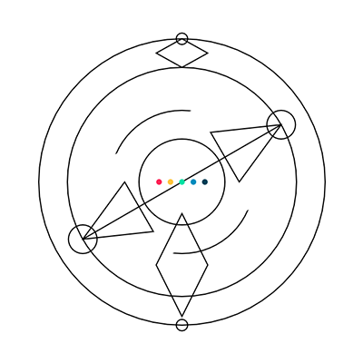

Generative Identity
===============
Using names to generate beautiful abstract visuals.

 ### Prologue

Our names are a very integral part of our lives, yet we don’t get to choose them. They are influenced by various factors such as race, religion and socio-economic status, infact it is this same influence that makes them so important. Our names control our lives in ways we can’t fathom.  
In this project I have coded a system that when given a name, generates a unique visual identity. 

This would classify under Generative Art, an autonomous system which is generally one that is non-human and can independently determine features of an artwork that would otherwise require decisions made directly by the artist. In a professional environment these generated visual could perhaps be used as an identity card.

## How to read the Identity

 1. **Center Shape**  

    The center shape of the visual is decided from the first alphabet of the name.

2. **Upper Shape**

    Does the name start and end with the same letter?

    Yes - Downward Arrows  
    No - Diamond

3. **Lower Shape**

    Is the total number of alphabets in the name odd or even?

    Odd - One Diamond  
    Even - Two Diamonds

4. **Circles In Orbiting Ring**

    No. of circle orbiting in the Outer ring are determined by the number of vowels in the name.